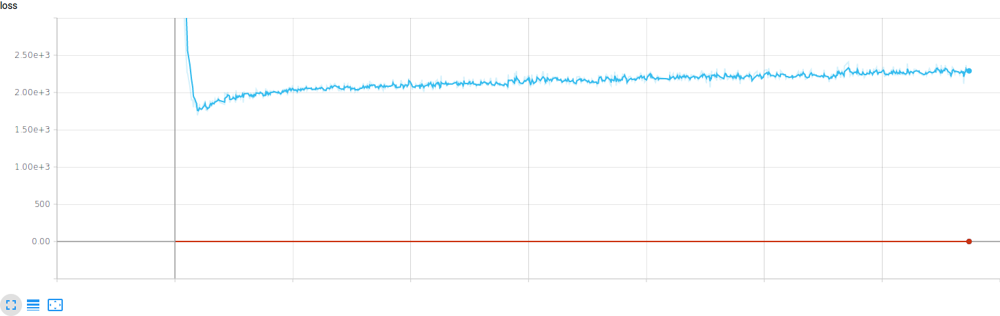
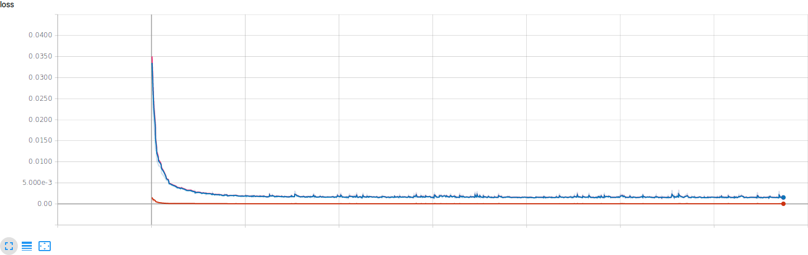
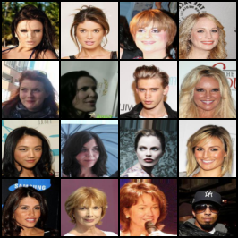
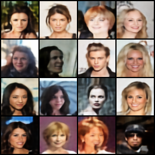
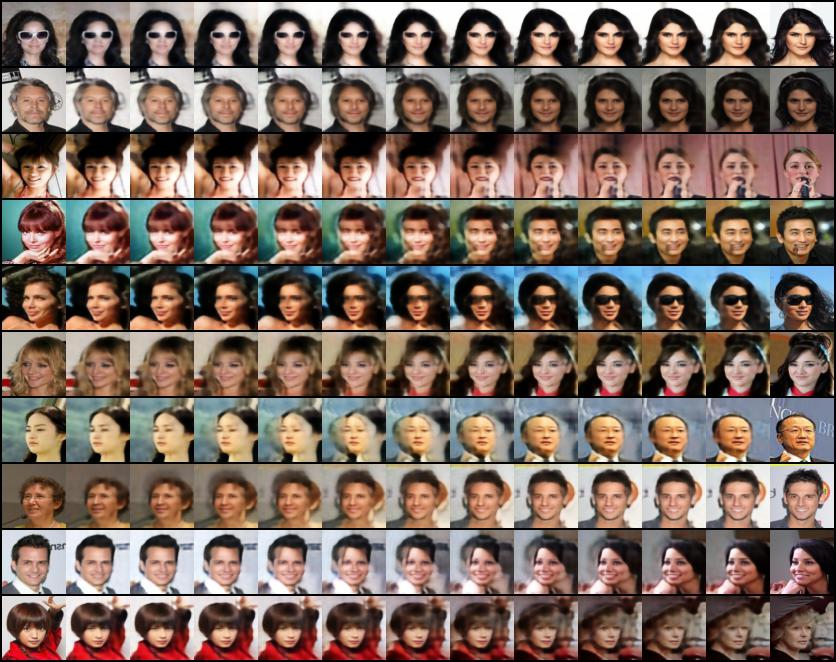

# infoVAE
This repository is reproducing of [InfoVAE:Information Maximizing Variational Autoencoders](https://arxiv.org/abs/1706.02262)

Experiments are done for celeba dataset

# Requirements
- Python 3.6
- Pytorch 0.4.0
- TensorboardX

# To Do
- [X] Reconstruction
- [ ] Generation
- [X] latent variable interpolation

# Results
- Loss of training

loss curve with kl divergence

loss curve without kl divergence

- Reconstruction results(left: original, right: reconstruction)

- Generation

- Latent variable interpolation

